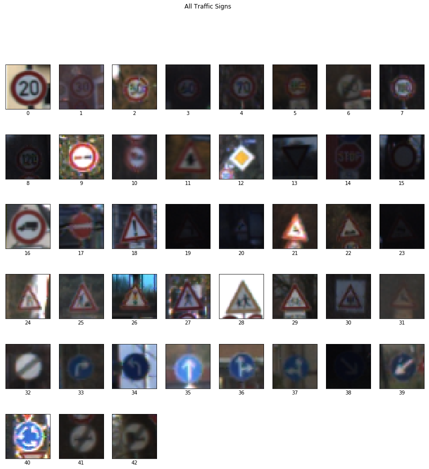
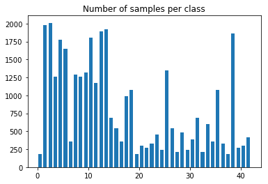
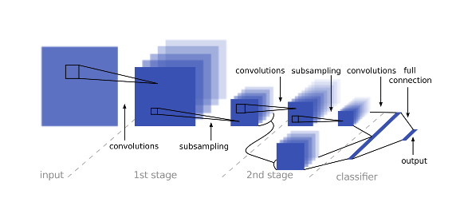
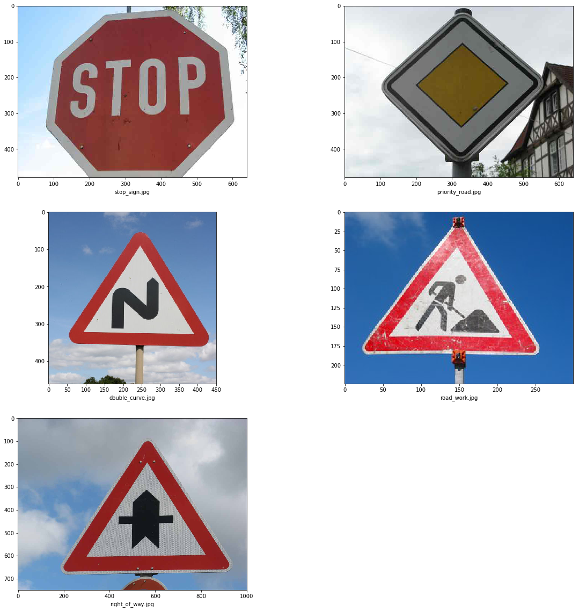
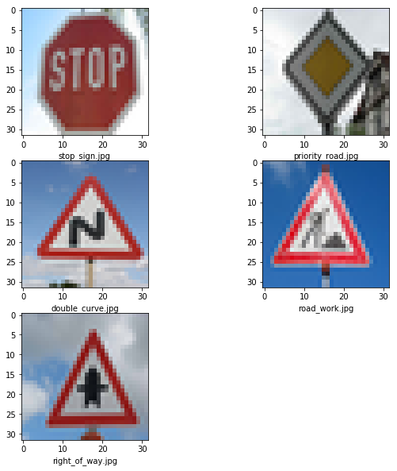
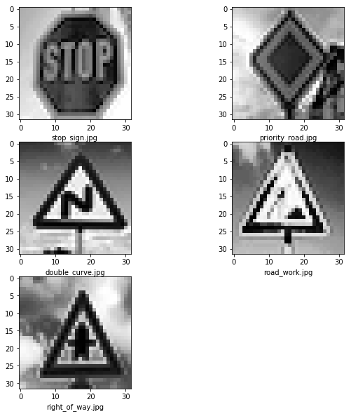

# Traffic Sign Classification

- - - -
The goals / steps of this project are the following:

* Load the data set (see below for links to the project data set)
* Explore, summarize and visualize the data set
* Design, train and test a model architecture achieving a minimum validation accuracy of 93%.
* Use the model to make predictions on new images
- - - -

### Dataset

The dataset used in this project was the **[German Traffic Sign Dataset](http://benchmark.ini.rub.de/?section=gtsrb&subsection=dataset)** which consists of **39, 209** images with dimensions **32x32x3** (height x width x channels) for training and **12, 630**  images for testing. The photographs are of German Traffic Signs and belong to one of the 43 types which can be mapped to the names of the traffic signs **[here]()**. The following is a visualisation of an image from each of the classes. 



The training dataset is highly unbalanced as we can see from the following image. There are classes having ~ 2000 images on one end and ~200 images on the other. Balancing the dataset in the future can lead to further improvement in model predictions but was not explored for this project. 



### Augmentation

A number of different augmentation techniques were tried. Helper methods were created to add *jitter*, *rotation* to the image. The best increase in accuracy was achieved by using **ImageDataGenerator** from **keras** for data augmentation. 

```
def augment_data(x_train, y_train):
        datagen = ImageDataGenerator(
        featurewise_center=False,
        featurewise_std_normalization=False,
        rotation_range=15,
        width_shift_range=0.2,
        height_shift_range=0.2,
        zoom_range=0.2,
        shear_range=0.2,
        horizontal_flip=False,
        vertical_flip=False)
        augmented_images = []
        augmented_labels = []
        datagen.fit(x_train)
        batch = 0
        for x_batch, y_batch in datagen.flow(x_train, y_train, batch_size=len(x_train)):
            augmented_images.append(x_batch)
            augmented_labels.append(y_batch)
            batch += 1
            if batch == 10:
                break
        return augmented_images, augmented_labels
```

Increasing the amount of data led to an increase in the validation accuracy thus achieved. The data was increased to a max of 10 images per image present in the training set.

### Preprocessing

The preprocessing of the images involved converting the image to single channel. The **Y channel** from the **YUV channel** was used as suggested by **[this paper](http://yann.lecun.com/exdb/publis/pdf/sermanet-ijcnn-11.pdf)**. The single channel images were then normalized. A number of different normalization techniques were tried out

- Min Max Normalization
- Histogram Equalization
- Global Contrast Normalization

Out of these 3 histogram equalization led to the highest validation accuracy. The code for these normalization techniques is included in the accompanying jupyter notebook.  Here we can see an image before and after normalization. 


### Model

A **multi-scale features** model was used instead of strict feed forward CNN. The model was inspired by  **[this paper](http://yann.lecun.com/exdb/publis/pdf/sermanet-ijcnn-11.pdf)**.  In this model output from the first convolutional layer was fed into the fully connected layer along with the output from the second convolutional layer. Increasing the number of filters at each convolutional layer to **108** was tried. This led to an increase in the validation accuracy but also led to increase in the time required to training the model. Instead of increasing the number of filters adding another convolutional layer should be tried in the future and the results compared. 



As the model was overfitting ( test accuracy < validation accuracy) a  **dropout of 0.5** was applied after the fully connected layer. This led to an increase in the test accuracy but overfitting was not completely eliminated. Further applying dropout after convolutional layers should prevent the model from overfitting. 

### Training

The model was trained for **40 epochs** due to time/budget constraints which took around 1.5 hours.  Training for longer time periods should yield a better result. A **batch size of 256** was used.  **AdamOptimizer** was used with a learning rate of **0.001**. Different learning rates were tried with 0.001 giving the right tradeoff between time to converge and validation accuracy. 

### Testing

The test accuracy of **96.7** was achieved which was less than the validation accuracy of **98.7** which was better than the initial goal of the project. This can be further improved adding more dropout/regularization techniques and creating a more balanced dataset. 

The model was then tested on 5 random images of the german traffic signs. These images were of different resolutions. They were first down sampled to 32 x 32, then the **Y Channel** was extracted and then they were normalized. An accuracy of 80% was achieved on these images. 

Original Images : 



Images after down sampling to 32x32 :



Images after extracting the Y channel and normalization :



The incorrect prediction was for the road works image. This can be corrected in the future by using better normalization technique/preprocessing. 

### Conclusion

I was able to achieve a validation accuracy of **98.7** and a test accuracy	of **96.7** with the current model. This was higher than the initial goal for the project. Since this was my first attempt at designing a neural network it took me around two weeks to finish the project. A number of lessons were learned which will lead to better implementations in the future. 
